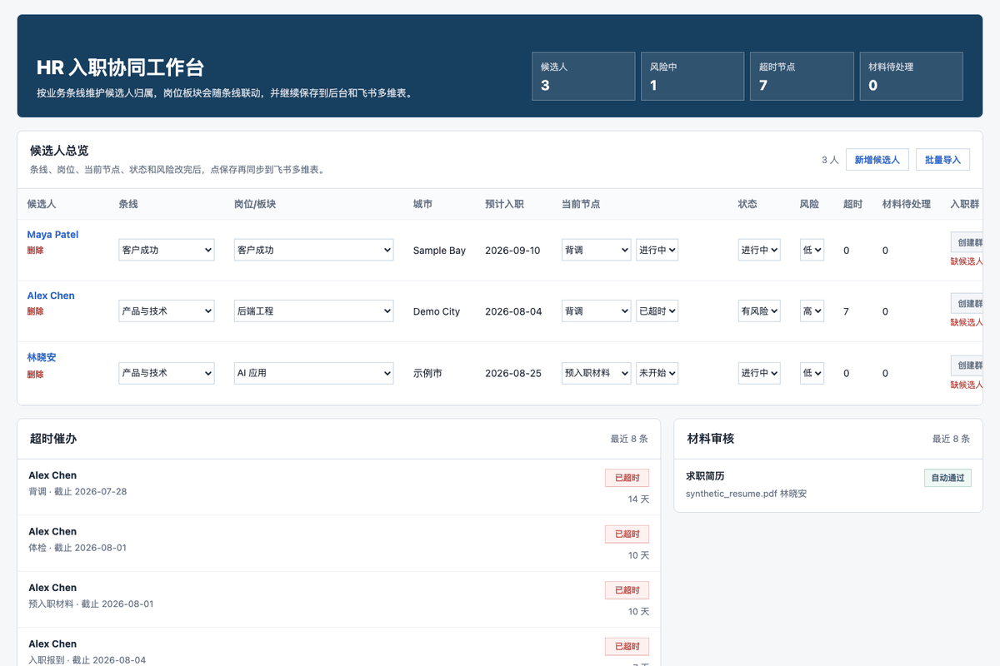
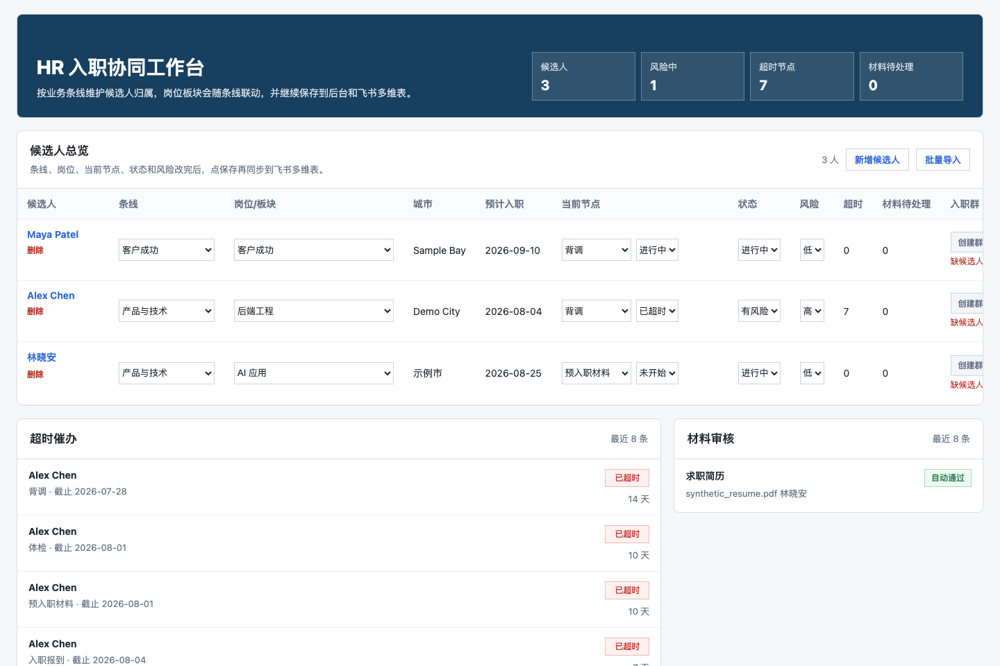
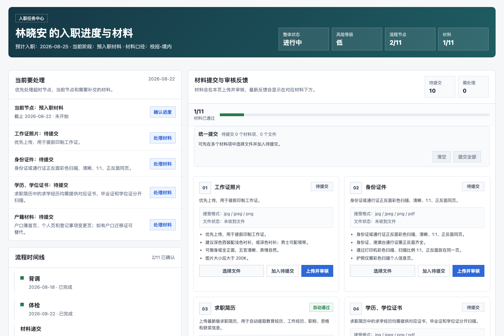
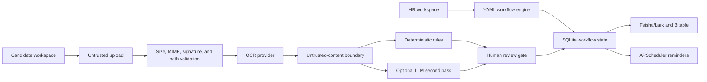

# HR Onboarding Agent

**Human-controlled AI onboarding for Feishu/Lark — configurable workflows, document OCR and review, Bitable sync, and reminders in one inspectable FastAPI app.**

[](https://github.com/z15114664687-dot/hr-onboarding-agent/actions/workflows/ci.yml)
[](https://github.com/z15114664687-dot/hr-onboarding-agent/actions/workflows/container.yml)
[](https://github.com/z15114664687-dot/hr-onboarding-agent/actions/workflows/codeql.yml)
[](https://www.python.org/)
[](LICENSE)



HR Onboarding Agent coordinates the journey from pre-boarding documents to HR review, reminders, and Feishu/Lark updates. Models assist with extraction and review; deterministic rules and people remain in control of consequential decisions.

- Run a complete local demo with three fictional candidates and no credentials.
- Give HR and candidates separate task-focused workspaces.
- Configure due dates, owners, visibility, and workflow nodes in safe YAML.
- Plug in mock, OpenAI, Gemini, Ark/Doubao, Zhipu, or DeepSeek paths.
- Treat uploads and OCR text as untrusted evidence, with manual-review gates.

> This is an early-stage reference implementation, not a payroll, identity-verification, legal, or autonomous hiring decision system. `DEMO_MODE=true` is intentionally open and must never process real HR data.

## Run the demo

Requirements: Python 3.11+.

```bash
git clone https://github.com/z15114664687-dot/hr-onboarding-agent.git
cd hr-onboarding-agent
./scripts/demo.sh
```

Open the [HR workspace](http://localhost:8000/ui/hr/workspace), [candidate workspace](http://localhost:8000/ui/candidate/1/workspace), or [health check](http://localhost:8000/health). The script creates a local virtual environment, installs pinned runtime dependencies, copies the safe demo configuration, and starts the app on localhost.

Docker users can run:

```bash
./scripts/demo.sh --docker
```

No Feishu/Lark account, model key, OCR key, or candidate record is required. External AI remains disabled.

## What you can try

The deterministic demo seeds three fictional candidate journeys only when the database is empty. You can:

1. review current, completed, and overdue workflow nodes;
2. update HR-owned fields and exercise the local Bitable synchronization path;
3. inspect material status and deterministic OCR/review output;
4. upload a synthetic PDF or image from the candidate workspace; and
5. see reminder-ready overdue state without sending a real notification.





The seed records live in [`examples/demo_candidates.json`](examples/demo_candidates.json). Synthetic prompt-injection regression files live in [`examples/demo_documents/`](examples/demo_documents/). Rebuild the screenshots with `./scripts/capture_demo.sh`.

## How it works



Uploaded documents and OCR-derived text are data, never instructions. Suspicious instruction overrides, secret requests, self-approval language, fake system prompts, active HTML, and unsafe URLs force manual review. This reduces risk; it does not eliminate prompt injection. Read the [architecture](docs/ARCHITECTURE.md) and [threat model](docs/THREAT_MODEL.md).

## Capabilities

| Capability | Status | Notes |
| --- | --- | --- |
| FastAPI + SQLite workflow | Implemented | Cases, nodes, materials, and idempotency |
| HR and candidate workspaces | Implemented | Explicit demo bypass; access controls outside demo |
| YAML workflow templates | Implemented | Safe loading, strict keys, bounded size/count, due-date rules |
| Upload validation | Implemented | Size, safe name, extension, MIME, magic bytes, confined path |
| Deterministic material review | Implemented | Advisory domain rules and human-controlled status |
| OCR and LLM providers | Implemented | Mock plus opt-in external provider paths |
| Feishu/Lark integration | Implemented | HTTP callback, long connection, cards, and Bitable |
| Scheduled reminders | Implemented | APScheduler overdue scan with idempotency |
| Python/SCA/SBOM/CodeQL CI | Implemented | Python 3.11, Docker smoke, Ruff, pip-audit, CycloneDX |
| Organization SSO/RBAC | Planned | Current non-demo HR boundary is HTTP Basic auth |
| Multi-tenant deployment | Planned | One deployment must not be shared across tenants |

## Configure the workflow

Set `WORKFLOW_CONFIG_PATH` to a version 1 YAML file. The default is [`examples/workflows/default.yaml`](examples/workflows/default.yaml); a shorter alternative is in [`examples/workflows/engineering.yaml`](examples/workflows/engineering.yaml).

```yaml
version: 1
name: Synthetic engineering onboarding
steps:
  - node_name: prepare_access
    display_name: Equipment and access
    offset: 0
    unit: calendar_day
    owner_role: it_admin
  - node_name: manager_check_in
    display_name: Manager check-in
    offset: 5
    unit: business_day
    owner_role: manager
```

Supported units are `calendar_day`, `business_day`, and `month`. Node names must be unique lowercase `snake_case`. Unknown keys, unsafe YAML tags, invalid roles, oversized files, and duplicate nodes fail closed at startup/use.

The active template is process-wide. Restart the application after changing `WORKFLOW_CONFIG_PATH` or its YAML file so UI labels, ordering, visibility, and new cases use one consistent catalog.

## Providers

| Provider | Text / Q&A | OCR / vision | Network used in demo |
| --- | ---: | ---: | ---: |
| Mock | Deterministic | Deterministic | No |
| OpenAI | Responses API | Image and PDF input | No |
| Gemini | Existing Q&A path | Adapter | No |
| Ark / Doubao | Document comparison | Adapter | No |
| Zhipu | Existing Q&A path | — | No |
| DeepSeek | Existing Q&A path | — | No |

External processing requires both `ALLOW_EXTERNAL_AI=true` and the chosen provider credentials. OpenAI support uses the existing `httpx` dependency, structured output when a schema is supplied, `input_image` for images, and `input_file` for PDFs. Provider tests use mocked transport only. See [provider setup](docs/LLM_PROVIDERS.md).

## Security posture

- HR/admin endpoints require HTTP Basic auth outside demo/test mode.
- Candidate links use expiring HMAC tokens bound to one case and then a SameSite, HttpOnly cookie.
- Feishu/Lark HTTP callbacks require a verification token, reject stale events, and claim idempotency keys.
- Provider endpoints require public HTTPS unless private endpoints are explicitly allowed.
- Raw event payload and OCR persistence are off by default.
- GitHub workflows run Python 3.11 tests, Docker health smoke, CodeQL, dependency review, pip-audit, Bandit, secret scanning, license inventory, and CycloneDX SBOM generation.

Files are not encrypted at rest or malware-scanned, and this version has no organization SSO, token revocation, retention engine, or multi-tenant isolation. Review [`SECURITY.md`](SECURITY.md), [`docs/THREAT_MODEL.md`](docs/THREAT_MODEL.md), and [`OSS_SECURITY_AUDIT.md`](OSS_SECURITY_AUDIT.md) before any real deployment.

## Development

```bash
python3.11 -m venv .venv
source .venv/bin/activate
python -m pip install -r requirements-dev.txt
./scripts/verify_release.sh
```

The suite needs no live credential or network call. Use `python scripts/audit_public_release.py --root .` before sharing a snapshot. GitHub launch settings and first issues are in [`docs/GITHUB_LAUNCH.md`](docs/GITHUB_LAUNCH.md).

## Roadmap

- Organization SSO/OIDC and role-based access control
- Encrypted object storage, malware scanning, retention, deletion, and restore tests
- PostgreSQL/Alembic and distributed scheduler ownership
- Authenticated Feishu/Lark encrypted callback handling
- Multi-tenant isolation and per-tenant keys
- Permission-aware retrieval and exportable audit logs
- Optional Slack/Teams adapters after the Feishu/Lark reference path is stable

See the [launch issue list](docs/GITHUB_LAUNCH.md#first-public-issues) for scoped contribution opportunities.

## Contributing and license

Read [`CONTRIBUTING.md`](CONTRIBUTING.md) before opening a pull request. Never put a vulnerability, credential, private document, or real candidate record in a public issue.

Licensed under the [Apache License 2.0](LICENSE).
