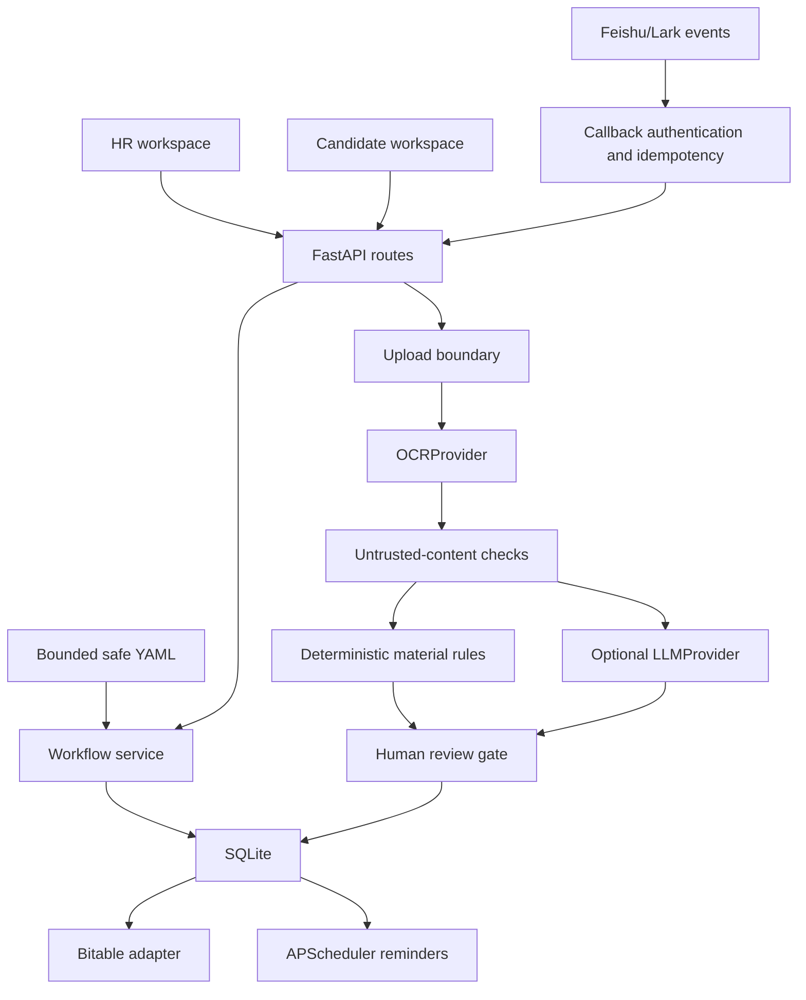

# Architecture

HR Onboarding Agent is a modular monolith. A single FastAPI application keeps the demo understandable while provider, workflow, integration, and security responsibilities remain separated behind focused modules.

## Runtime components

| Component | Responsibility |
| --- | --- |
| `app.main` | FastAPI startup, schema creation, demo seeding, scheduler lifecycle |
| `api/routes/pages.py` | Server-rendered HR/candidate workspaces and validated uploads |
| `api/routes/admin.py` | Authenticated HR operations and integration commands |
| `api/routes/feishu_events.py` | Feishu/Lark callback validation and dispatch |
| `workers/feishu_event_listener.py` | Optional long-connection listener |
| `services/workflow_config.py` | Bounded safe-YAML schema and node validation |
| `services/onboarding_workflow.py` | Node creation, transitions, due dates, overdue scans |
| `services/material_submission_flow.py` | Review, persistence, sync, and notification orchestration |
| `providers/` | `LLMProvider`/`OCRProvider` protocols and mock/OpenAI/legacy adapters |
| `services/qa_service.py` | Local retrieval and optional provider generation |
| `adapters/` | Feishu/Lark auth, Bitable, IM, contact, and chat APIs |

## Configuration lifecycle

`Settings` reads environment variables once per process. The active file at `WORKFLOW_CONFIG_PATH` is loaded and cached process-wide so UI labels, visibility, ordering, and case creation share one catalog. The loader resolves project-relative paths, caps the file at 128 KiB and 64 nodes, uses `yaml.safe_load`, rejects unknown keys, and validates unique node codes, units, roles, offsets, visibility, and string lengths. Invalid configuration fails instead of silently falling back; a configuration change requires an application restart.

## Persistence and deployment

SQLite stores candidate cases, workflow nodes, material-review records, and idempotency claims. It is appropriate for a single-instance demo and small controlled deployment. Scale-out requires a shared transactional database, migrations, scheduler leader election, and multi-tenant boundaries.

Uploaded files live below `UPLOAD_ROOT`. Paths, types, signatures, and sizes are checked, but files are not encrypted or malware-scanned. Use private object storage plus retention/deletion controls before processing real documents.

## Trust boundaries

1. Browser boundary: explicit demo bypass or HR/candidate authorization.
2. Workflow boundary: bounded safe YAML with strict schema validation.
3. File boundary: decoded size, name, extension, MIME, signature, and path confinement.
4. AI boundary: untrusted-document notice, delimited evidence, deterministic injection checks, and human review.
5. Integration boundary: Feishu token, freshness, idempotency, outbound-AI opt-in, and Bitable credentials.
6. Action boundary: model output is advisory; application code owns persistence and notifications.

See [THREAT_MODEL.md](THREAT_MODEL.md) and [DATA_FLOW.md](DATA_FLOW.md).
