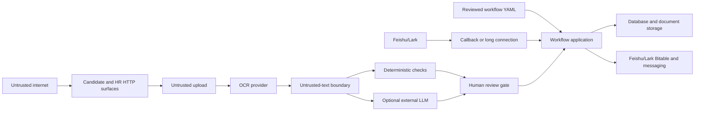

# Threat model

Status: initial public-release model, 2026-08-11. This is a design review, not a certification or penetration-test report.

## Scope and security goals

The system collects candidate documents, extracts text, asks optional external models for assistance, stores workflow state, and connects to Feishu/Lark. The primary goals are to prevent unauthorized access, keep untrusted document content from controlling the agent, avoid leaking HR data, and keep every consequential review decision attributable to a human-controlled workflow.

Trust boundaries exist at every browser request, uploaded byte stream, OCR result, model response, Feishu/Lark callback, provider URL, and database write. OCR text and model output are data, not trusted instructions.

## Assets and actors

Assets include candidate identity and contact data, uploaded documents, OCR output, workflow decisions, provider and Feishu credentials, candidate access links, HR credentials, event identifiers, logs, and Bitable records. Expected actors are candidates, HR operators, Feishu/Lark, configured AI providers, and maintainers. Threat actors include unauthenticated internet users, malicious or compromised candidates, forged integrations, compromised providers, dependency attackers, and over-privileged contributors.

## Risk register

| Risk | Current control | Residual status |
| --- | --- | --- |
| Prompt injection in documents or OCR | Delimited untrusted-content prompt, deterministic pattern checks, forced manual review | Reduced, not eliminated |
| Unsafe or malformed workflow YAML | Size/node bounds, `safe_load`, strict keys/types/enums, unique node names, fail-closed errors | Reduced; configuration still requires review |
| Fake system instructions, secret requests, or self-approval text | Security findings block automatic acceptance | Reduced |
| Active or hidden HTML in uploads/OCR | MIME/magic validation and suspicious-content detection | Reduced; no full content disarm |
| Malicious model output | Model output remains advisory; deterministic and human gates remain | Reduced |
| Forged Feishu/Lark HTTP callback | Verification token is required and compared in constant time | Reduced |
| Callback replay | Event age bound plus unique event idempotency record | Reduced |
| Encrypted callback handled without authentication | Encrypted payloads are rejected | Safe failure; feature unavailable |
| Long-connection event forgery | Relies on official SDK transport and app credentials | Provider-dependent |
| Missing HR authentication | Non-demo HR/admin endpoints require HTTP Basic auth | Reduced; RBAC planned |
| Candidate ID enumeration / IDOR | Case-bound expiring HMAC links return a uniform 404 when invalid | Reduced |
| Candidate token theft | HttpOnly, SameSite cookie; HTTPS required in production | Residual until revocation/audience controls |
| CSRF | Same-origin check on browser state changes and SameSite candidate cookie | Reduced |
| XSS from stored candidate or document text | HTML rendering escapes dynamic values | Reduced; maintain regression tests |
| Oversized upload / resource exhaustion | Decoded byte limit before storage | Reduced; proxy-level limits still needed |
| MIME or extension confusion | Per-material extension allowlist plus MIME and magic-byte checks | Reduced |
| Path traversal / arbitrary local file read | Random stored names and resolved-path confinement | Reduced |
| Malware in otherwise valid PDF/image | No antivirus or sandbox | Open; add scanning before production |
| SSRF through provider or document URLs | Provider base URLs require public HTTPS by default; suspicious local/metadata URLs trigger review | Reduced; egress allowlist recommended |
| Secrets in source or fixtures | Placeholder-only environment template, deterministic snapshot audit, CI secret scan | Reduced; GitHub push protection must be enabled after creation |
| Secrets or PII in logs | Message text and identifiers are not logged; raw event storage is opt-in | Reduced; operator logging config matters |
| External model disclosure | External AI is off by default and requires explicit opt-in | Governance decision remains with deployer |
| Excessive OCR/event retention | Raw OCR and raw event payload storage are off by default | Document/field retention engine is planned |
| Database injection | SQLAlchemy query construction; no user-composed SQL | Reduced |
| Database or file theft | No encryption at rest in this version | Open; use encrypted managed storage |
| Reminder/scheduler abuse | Single bounded scheduled scan with idempotency | Reduced; distributed locking is planned |
| Provider outage or malformed response | Timeouts, deterministic fallback paths, human review | Reduced |
| Dependency or CI supply-chain compromise | Exact Python versions, immutable Action SHAs, read-only tokens, pip-audit, SBOM, license inventory, CodeQL, dependency review | Reduced; base-image digest and alert triage remain owner work |
| Malicious contribution or fixture | Synthetic-data rule, focused tests, security-review guidance | Process control; maintainer review required |
| Multi-tenant data crossover | Multi-tenancy is not implemented | Out of scope; do not share one deployment across tenants |

## Security invariants

1. Demo mode never contains or sends real candidate data.
2. No uploaded or OCR-derived content can directly select tools, reveal secrets, approve itself, or bypass a human gate.
3. External AI is disabled unless explicitly enabled.
4. Non-demo candidate access is bound to one case and expires.
5. Non-demo HR and admin pages fail closed when credentials are absent.
6. Feishu/Lark HTTP callbacks fail closed on missing authentication, stale timestamps, or unsupported encryption.
7. Local file access stays under the configured upload root.
8. Sensitive payload persistence is opt-in, not the default.
9. Invalid or unsafe workflow configuration fails closed and never executes YAML-provided code.

## Production gaps

Before processing real HR data, add organization-grade SSO/RBAC, token revocation, encrypted object storage, malware scanning, retention/deletion workflows, backups and restore tests, centralized audit logs, rate limits, reverse-proxy upload limits, egress allowlists, managed secrets, data-processing agreements for every provider, and a pinned base-image digest. Enable the repository-level GitHub security settings after publication. Implement and test authenticated Feishu/Lark callback decryption if encrypted callbacks are required.
